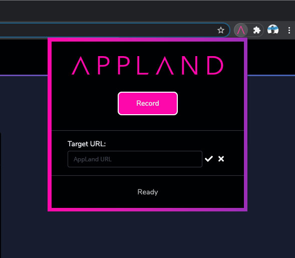



# Recording AppMaps with the AppLand browser extension

## Overview
---



AppLand "remote recording" is an easy way to record and analyze end-user flows for applications with a web-based UI. Remote recording is composed of two parts:

- The AppLand client for your programming language, which runs on the server side and makes the actual recordings of the code. To review setup instructions for the AppLand client, review the client setup instructions for [Ruby](#recording-appmaps-with-ruby) or [Java](#recording-appmaps-with-java).
- A browser extension which is used to start and finish recordings.

This guide assumes that you have the AppLand client installed and running with your application server code. By following the steps shown here, you will install the browser extension and use it to create, upload and view an AppMap.

## Step 1: Install the AppLand browser extension
---
Install the AppLand browser extension for either [Chrome](https://chrome.google.com/webstore/detail/appland/pgicekejplaefmcfiehhpiambdalpgmj) or [Firefox](https://addons.mozilla.org/en-US/firefox/addon/appland/).
You will now see the AppLand logo displayed in your extensions area.
Step 2: Enable AppLand remote recording for your project

***Don't enable AppLand remote recording in production. AppLand remote recording will serve recording results to any client request, without authentication.***

### Ruby

Add the AppMap remote recording middleware.

For example, in `config/initializers/appmap_remote_recording.rb` :

```
require 'appmap/middleware/remote_recording'

if Rails.env.development?
Rails.application.config.middleware.insert_after \
  Rails::Rack::Logger,
  AppMap::Middleware::RemoteRecording
end
```
Start your Rails server.

For example:
```
$ bundle exec rails server
```
###Java

When you run a Java process with the `appmap.jar` agent loaded, it will automatically enable remote recording.

Do not load `appmap.jar` in production environments.

## Step 3: Record an AppMap
---
Recording an appmap is easy.

1. Click on the appland icon next to the search bar in the head of your browser. This will open a small window.
2. Push the red round button to start recording.
3. Use your application as you normally would. Go through an end-user flow that you would like to analyze. As you click around and do stuff in your application, AppLand records what is happening on the back end.
4. When you are finished using your app, open the AppMap browser extension again. And push the red square button to stop recording.
5. The recording will be transferred to the AppLand website opened. A new browser tab will open on app.land.

## Step 4: Open the AppMap in AppLand
---
When you stop recording your appmap will open in a new browser tab automatically. This may take a minute to render depending on the size of the recording you made. When you upload the scenario, you may want to assign it a descriptive name and other attributes that will help you find it in the future.
